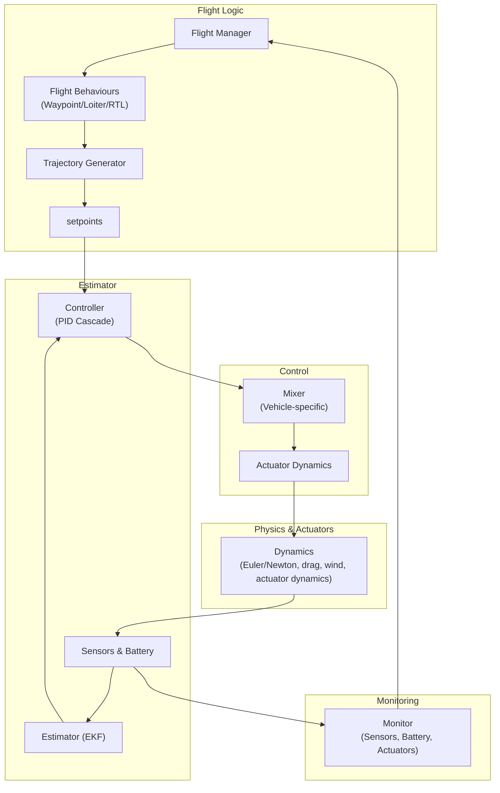

# Drone Simulator Architecture

This document describes the **modular architecture** of the drone simulator, detailing the main components, their responsibilities, and how they interact in both self-contained and backend modes.  

The simulator supports quadcopter and hexacopter models, including **self-contained flight control** or integration with external controllers via ROS2/MAVLink.  

---

## 1. Overview

The simulator is **modular, real-time, and flexible**, designed for both demonstrations and integration with external autopilots.  

Key principles:  

- **Modularity:** Each subsystem is isolated for clarity and extensibility.  
- **Real-time simulation:** Physics and control loops advance consistently at each timestep.  
- **Flexibility:** Supports self-contained flight control and external interfaces.  

---

## 2. High-Level Module Diagram (Logical Flow)

---

## 3. Module Descriptions

### Dynamics
- Computes **rigid-body Euler & Newton dynamics** 
- Includes **quadratic drag** based on airspeed.  
- Responds to **user-selected wind conditions** (set via editor tab).  
- Depends on **actuator dynamics** (see `quadcopterX_overview.md`).  

### Sensors
- Simulates: IMU, GPS, Magnetometer, Barometer.  
- Adds **white noise and random walk** processes for realism.  
- Handles **sampling rates and quantization**, producing sensor outputs for the control loop.  

### Controller
- Current implementation: **PID Cascade Controller**.  
- Structure:  
  - Outer loop: position & velocity  
  - Inner loop: attitude & rate  
- Outputs **control commands** for the mixer.  

### Mixer
- Vehicle-specific module.  
- Converts **controller outputs** into **actuator commands** based on frame type (quad/hex).  

### Actuator
- Simulates **motor and ESC dynamics**, including:  
  - Speed, voltage, current, temperature  
  - Optional inner ESC control loop  
  - Automatic shutdown conditions  
- Generates inputs for the **dynamics module**.  

### Flight Manager
- Determines **active flight mode** (manual, autonomous, RTL, loiter).  
- Chooses which **behaviour module** is currently active.  

### Waypoint / Loiter / RTL Behaviours
- Triggered by flight mode selection.  
- Generate **trajectory targets** and monitor their completion.  

### Trajectory Generator
- Receives trajectory targets from behaviours.  
- Computes **setpoints at each timestep** (position, velocity, attitude).  

### Battery
- Simulates **battery capacity, voltage, and consumption**.  
- Interacts with actuator dynamics to reflect realistic power usage.  

### Monitor
- Observes **sensors, actuators, and battery**.  
- Provides status updates read by the **flight manager**.  

---

## 4. Self-Contained vs Backend Mode

| Mode               | Control Location                 | Simulator Responsibility                                   |
|-------------------|---------------------------------|-----------------------------------------------------------|
| Self-Contained     | Internal simulator               | Flight control, dynamics, actuators, sensors, battery    |
| Backend Only       | External controller/autopilot   | Dynamics, actuators, sensors, battery; receives commands |

**Notes:**  
- Self-contained mode is ideal for demos and offline testing.  
- Backend mode enables integration with ROS2/MAVLink or other flight software.  

---

## 5. Design Principles

- **Separation of concerns:** Control, physics, and sensor simulation are modular.  
- **Extensibility:** Easily add new behaviours, drones, or sensors.  
- **Real-time operation:** Actuator commands advance simulation timestep consistently.  
- **Observability:** Monitors provide real-time status feedback to flight manager and users.  

---

## 6. Summary

The simulator’s **modular, flexible, and real-time architecture** enables:  

- Fully self-contained drone simulations  
- External autopilot or ROS2/MAVLink integration  
- Easy addition of drones, behaviours, and sensors  
- Observation of dynamics, trajectory execution, and control performance in real-time  

This architecture highlights both the **technical sophistication** and **usability** of the simulator for autonomous systems research, drone development, and aerospace applications.

